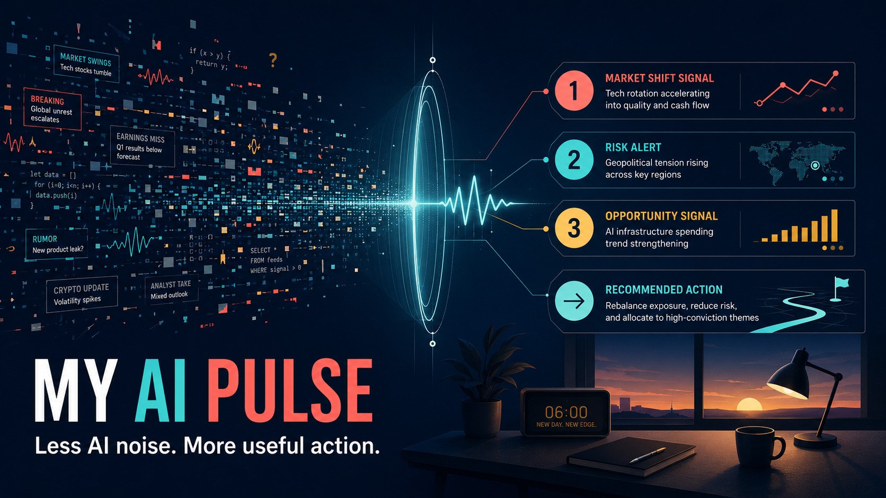
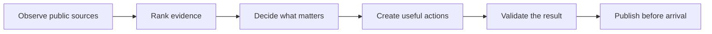
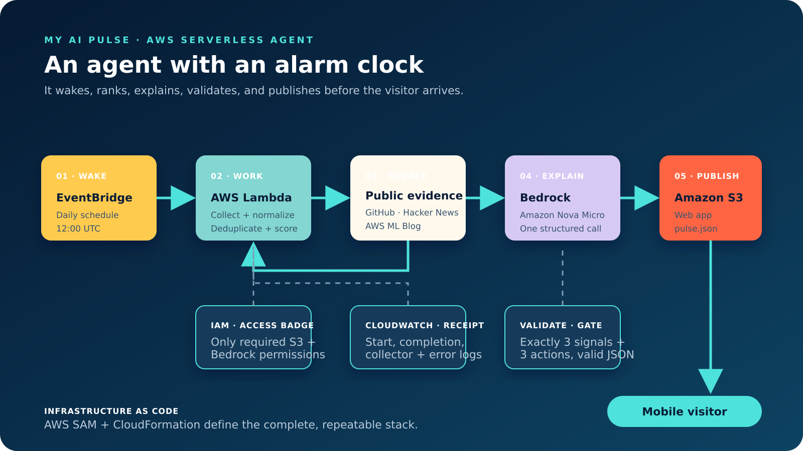

# My AI Pulse (MAP)

**Less AI noise. More useful action.**



[Open the live app](https://my-ai-pulse-webbucket-yyecioxzceuw.s3.us-east-1.amazonaws.com/index.html) · [View the architecture](docs/ARCHITECTURE.md) · [Read the product requirements](docs/PRD.md)

My AI Pulse—**MAP** for short—is an always-on AWS agent that separates useful AI signals from the daily noise. It wakes on a schedule, gathers current developments from public sources, ranks the evidence, decides what deserves attention, and publishes a practical intelligence brief before the visitor arrives.

MAP was built through [Skilium](https://skilium.ai), an AI skills company focused on turning fast-moving AI developments into practical capabilities people can use at work.

Built for the **AWS Builder Center Always-On Agent Weekend Challenge**.

## MAP at a glance

| Question | Answer |
|---|---|
| What job does the agent perform? | Separates AI signal from noise and turns it into practical action |
| When does it run? | Daily at 12:00 UTC |
| What does it monitor? | GitHub, Hacker News, and the AWS Machine Learning Blog |
| What does it publish? | Three ranked signals and three independent activities |
| How long do the activities take? | 5, 10, or 15 minutes |
| How many candidates reach Bedrock? | At most five |
| How many Bedrock calls happen per run? | One |
| How many model calls happen when the page opens? | Zero |
| Where is the result stored? | Amazon S3 as `data/pulse.json` |

## The problem

AI professionals do not have an information shortage. We have a prioritization problem.

Every day brings another model, repository, product launch, benchmark, and confident prediction. The difficult questions are:

- Is this actually important?
- Why does it matter to my work?
- What can I do with it today?

More information does not automatically create more capability. MAP reduces the stream to a small number of credible signals and gives the user a clear next move.

## What makes MAP agentic

MAP does not wait for a visitor to enter a prompt or click a generation button. It has a defined job, a schedule, decision rules, tools, validation, and a publishing destination.



By the time someone opens the application, the agent has already observed, prioritized, reasoned, and acted. The visitor arrives to a finished brief—not an empty prompt box.

## What visitors can do

- Scan three prioritized AI signals and their evidence scores.
- See why each signal matters without reading every source.
- Open the original source for deeper investigation.
- Choose one, two, or all three practical activities.
- Copy a ready-to-use prompt for each activity.
- Mark activities complete on the current device.
- Share progress through the device share sheet or clipboard.

The three activity paths support different levels of time and confidence:

| Path | Time | Outcome |
|---|---:|---|
| Quick Win | 5 min | Explain one signal in the user's work context |
| Apply It | 10 min | Turn a repeated task into an AI-assisted workflow |
| Scale It | 15 min | Design a small, team-ready AI experiment |

## Architecture



| AWS service | Plain-language job | Role in MAP |
|---|---|---|
| Amazon EventBridge | Alarm clock | Wakes the agent every day without a user action |
| AWS Lambda | Worker | Collects, ranks, calls the model, validates, and publishes |
| Amazon Bedrock + Nova Micro | AI editor | Converts compact evidence into explanations and activities |
| Amazon S3 | Publishing desk | Hosts the web app and stores the reusable daily pulse |
| Amazon CloudWatch | Activity log | Records starts, completions, collector results, and errors |
| AWS IAM | Access badge | Limits Lambda to the Bedrock and S3 actions it requires |
| AWS SAM + CloudFormation | Blueprint | Defines and deploys the AWS stack as repeatable code |

For the complete data flow, permissions, cost controls, and design trade-offs, see [docs/ARCHITECTURE.md](docs/ARCHITECTURE.md).

## How the signal engine works

1. EventBridge invokes the Lambda function every day at 12:00 UTC.
2. Lambda requests small candidate sets from GitHub, Hacker News, and the AWS Machine Learning Blog.
3. Python normalizes the results, removes duplicates, and scores each candidate.
4. The five strongest candidates are sent to Amazon Bedrock Nova Micro in one compact request.
5. Bedrock returns exactly three signals and three practical activities as structured JSON.
6. Lambda validates the structure and adds evidence scores.
7. Lambda publishes the finished result to `data/pulse.json` in Amazon S3.
8. Every visitor reads the same prepared pulse without creating another model call.

### Transparent ranking

Before the model sees anything, deterministic code assigns up to 100 points:

| Ranking factor | Maximum points |
|---|---:|
| Popularity | 40 |
| Freshness | 35 |
| Professional relevance | 25 |

The code chooses the finalists. The model explains why they matter and suggests what to do next.

## Token and cost discipline

MAP uses a funnel instead of sending the full internet to a model:

```text
Up to 30 public candidates
          ↓
   5 ranked finalists
          ↓
    1 Bedrock request
          ↓
3 signals + 3 activities
          ↓
1 cached pulse for every visitor
```

- One scheduled Bedrock call per agent run.
- At most five compact candidates in the prompt.
- Maximum model output of 1,200 tokens.
- No model call when a visitor opens the application.
- No paid external data APIs.
- Serverless AWS services with no continuously running server.

Exact AWS costs depend on region, traffic, model pricing, and account configuration. Configure AWS Budgets and billing alerts before deploying your own copy.

## Repository map

| Path | Purpose |
|---|---|
| `frontend/` | Static Signal Desk interface and sample pulse |
| `frontend/data/pulse.json` | Local sample of the agent's published result |
| `backend/app.py` | Collection, ranking, Bedrock, validation, and publishing logic |
| `infrastructure/template.yaml` | AWS SAM infrastructure definition |
| `scripts/upload-frontend.sh` | Uploads the static frontend to the deployed S3 bucket |
| `assets/` | Product visuals and architecture diagrams |
| `docs/` | PRD, user stories, architecture, tracker, test plan, and build log |

## Preview locally

Local preview means opening the frontend on your own computer. It does not deploy or change any AWS resources.

From the repository root, run:

```bash
python3 -m http.server 8000 --directory frontend
```

Then open [http://localhost:8000](http://localhost:8000) in a browser.

## Deploy to AWS

### Prerequisites

- An active AWS account with billing enabled.
- AWS CLI authenticated to the intended account.
- AWS SAM CLI installed.
- Access to Amazon Nova Micro in `us-east-1`.

First, confirm that the AWS CLI can identify the signed-in account:

```bash
aws sts get-caller-identity
```

From the repository root, validate and build the stack:

```bash
sam validate --lint --template-file infrastructure/template.yaml
sam build --template-file infrastructure/template.yaml
```

For the first deployment, use the guided setup:

```bash
sam deploy --guided
```

Recommended guided values:

| Prompt | Value |
|---|---|
| Stack name | `my-ai-pulse` |
| Region | `us-east-1` |
| Model ID | `amazon.nova-micro-v1:0` |
| Confirm changes before deploy | `y` |
| Allow SAM CLI IAM role creation | `y` |
| Disable rollback | `n` |
| Save arguments | `y` |

After deployment, copy the `BucketName` shown in the CloudFormation outputs and upload the frontend:

```bash
bash scripts/upload-frontend.sh YOUR_BUCKET_NAME
```

Invoke the deployed Lambda once to create the first live pulse. Replace the placeholder with the `FunctionName` from the deployment outputs:

```bash
aws lambda invoke \
  --function-name YOUR_FUNCTION_NAME \
  --cli-binary-format raw-in-base64-out \
  --payload '{}' \
  /tmp/pulse-result.json
```

A response containing `"StatusCode": 200` means the function ran successfully in AWS.

Future pulses are generated by the EventBridge schedule.

## Privacy and security

- The MVP has no user accounts.
- It does not send visitor profile data to AWS.
- Activity completion is stored only in the visitor's browser using local storage.
- AWS access keys are not stored in the repository.
- Lambda receives only the S3 and Bedrock permissions required for its job.
- Public-source text is truncated before it enters the model prompt.
- Bedrock output is validated before publication.

## Current MVP limitations

- Progress is stored on one browser and does not follow the user across devices.
- Shared links do not preserve a user's activity history.
- The pulse currently contains three signals rather than five.
- The S3 website endpoint is HTTP-only; a production version should add CloudFront and HTTPS.
- The agent relies on three public sources and gracefully continues when one source fails.

## Next improvements

The next version is expected to explore:

- Five daily stories: three practical signals and two technology-radar stories.
- Day and date displayed prominently on every pulse.
- Optional name, professional title, and profile picture.
- Cross-device progress and history.
- Read-only share snapshots that do not expose private history.

These items are roadmap ideas, not features in the current MVP.

## Documentation

- [Product requirements](docs/PRD.md)
- [User stories](docs/USER-STORIES.md)
- [Architecture](docs/ARCHITECTURE.md)
- [Project tracker](docs/PROJECT-TRACKER.md)
- [Test plan](docs/TEST-PLAN.md)
- [Build log](docs/BUILD-LOG.md)

## License

This project is available under the [MIT License](LICENSE).
