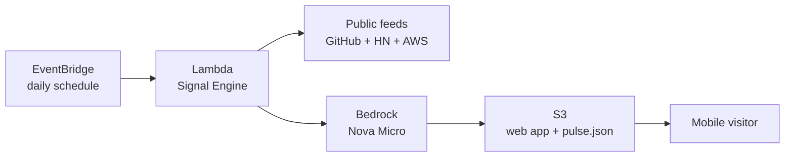
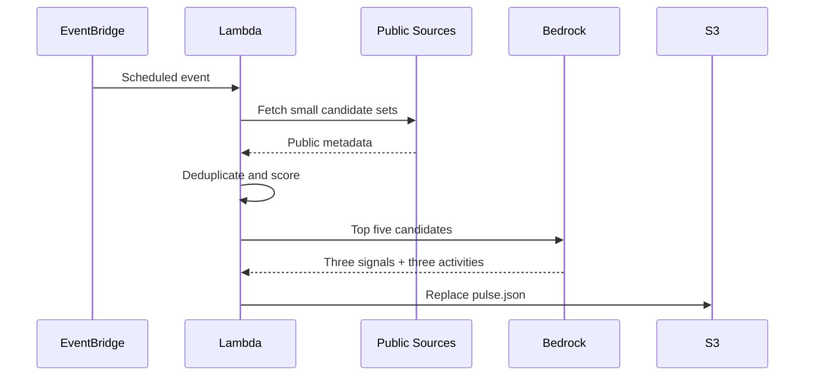

# My AI Pulse — AWS Architecture

## Architecture Decision

The challenge MVP uses a scheduled serverless pipeline and a static mobile web interface. The pipeline prepares one cached result for every visitor. User traffic therefore does not create Bedrock calls.



## Plain-Language Service Map

| Component | Plain-language role | Why selected |
|---|---|---|
| EventBridge | Alarm clock | Proves the agent wakes without a button click |
| Lambda | Short-lived worker | No server management; pay only while it runs |
| Bedrock Nova Micro | AI editor | Low-cost model turns ranked evidence into concise guidance |
| S3 | Filing cabinet and website host | Stores the app and one reusable daily pulse |
| CloudWatch | Activity log | Provides evidence that scheduled runs happened |

## Signal Engine v1

1. Fetch up to 10 candidates from each public source.
2. Normalize title, URL, source, timestamp, summary, and attention score.
3. Remove duplicate URLs and near-identical titles.
4. Score candidates before any AI call.
5. Pass at most five compact candidates to Nova Micro.
6. Validate the model's JSON response.
7. Save three signals and three activity choices to `data/pulse.json`.

### Ranking formula

```text
total score = popularity (40) + freshness (35) + relevance (25)
```

This is intentionally transparent. Model judgment formats and explains the finalists; it does not decide what to crawl or process every raw item.

## Data Flow



## Cost and Token Controls

- One scheduled Bedrock call per day.
- Maximum five compact candidates per prompt.
- Maximum 1,200 output tokens for three concise signals and three short activity choices.
- Temperature `0.2` for consistent structured output.
- No Bedrock call per visitor.
- No paid external data APIs.
- Lambda timeout of 60 seconds.
- Public-source requests use explicit timeouts.

## Security and Privacy

- Lambda receives only the S3 and Bedrock permissions it needs.
- No AWS access keys are stored in code.
- No visitor personal data is sent to AWS.
- Completion state remains in browser local storage.
- Public-source text is truncated before entering the prompt.
- Links are rendered through DOM properties rather than raw HTML injection.

## Important Trade-off

S3 website hosting is the fastest challenge path, but its website endpoint is HTTP-only. A production version should add CloudFront for HTTPS and caching. The challenge MVP prioritizes a working public demonstration and public source repository.
